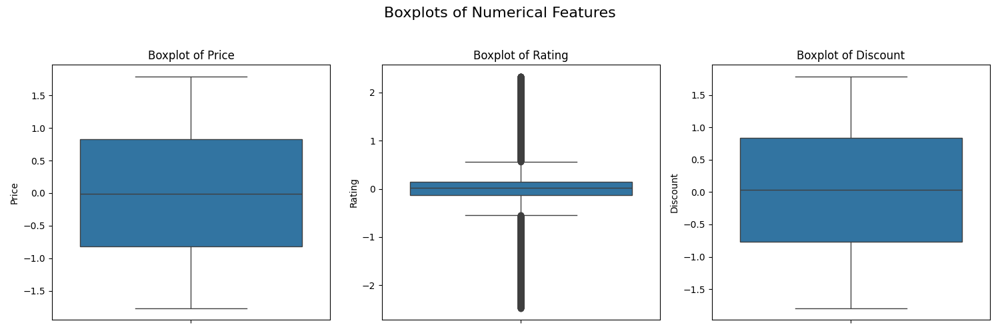

# Retail Product Dataset - Data Cleaning and Preprocessing

This project demonstrates the process of cleaning and preparing a raw dataset for machine learning tasks using Python. The dataset used is the Retail Product Dataset containing missing values and mixed data types.

## Project Overview

The goal is to perform the following key steps to prepare the data:

1. Import the dataset and explore its structure, including null values and data types.
2. Handle missing values by imputing numerical columns with median values and categorical columns with the mode.
3. Convert categorical features to numerical format using one-hot encoding.
4. Normalize and standardize the numerical features using `StandardScaler`.
5. Visualize outliers via boxplots and remove them using the Interquartile Range (IQR) method.

## Dataset

The dataset consists of product-related features with missing data points, such as Category, Price, Rating, Stock, and Discount. It is sourced from Kaggle: [Retail Product Dataset with Missing Values](https://www.kaggle.com/datasets/himelsarder/retail-product-dataset-with-missing-values).

## Visualization



**Description:**  
- Boxplots for numerical features such as Price, Rating, Stock, and Discount.  
- Visualizes the distribution and identifies outliers in the data before cleaning.

**Insights:**  
- Helps understand the spread and variability of each numerical feature.  
- Identifies potential outliers that can skew analysis or model performance.  
- These outliers are then removed using the IQR method to clean the data.dataset.

## Output

- The script outputs dataset information before and after cleaning.
- Visualizes boxplots of numerical features to identify outliers.
- Prints the shape of the cleaned dataset after outlier removal.

## Notes

- The code uses median and mode imputation to handle missing values.
- Outliers are detected and removed using the IQR rule for cleaner data.
- Encoding converts categorical variables to numeric for ML models.

---

## Tools and Libraries

- Python 3.x
- Pandas
- NumPy
- Matplotlib
- Seaborn
- scikit-learn

## How to Run

1. Clone or download this repository.
2. Download the dataset CSV (`retail_product.csv`) from Kaggle and place it in the project directory.
3. Create and activate a Python virtual environment.

```bash
python -m venv venv

source venv/bin/activate # On Windows: .\venv\Scripts\activate
```

4. Install required libraries:

```bash
pip install pandas numpy matplotlib seaborn scikit-learn
```

5. Run the data cleaning script:

```bash
python datacleaning.py
```

## Contact

For questions or collaboration:

- **Name**: Ghanashyam T V
- **Email**: [ghanashyamtv16@gmail.com](mailto:ghanashyamtv16@gmail.com)
- **LinkedIn**: [linkedin.com/in/ghanashyam-tv](https://www.linkedin.com/in/ghanashyam-tv)

---

Feel free to modify the script for other datasets or extend it with further preprocessing and exploratory analysis.

