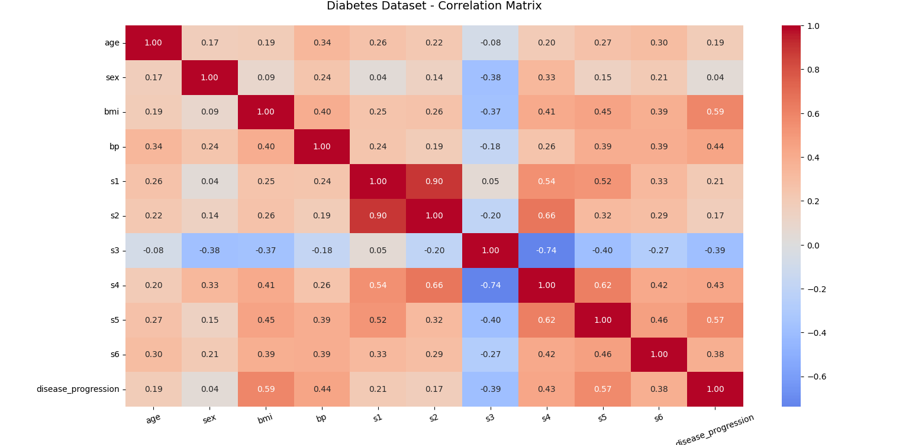
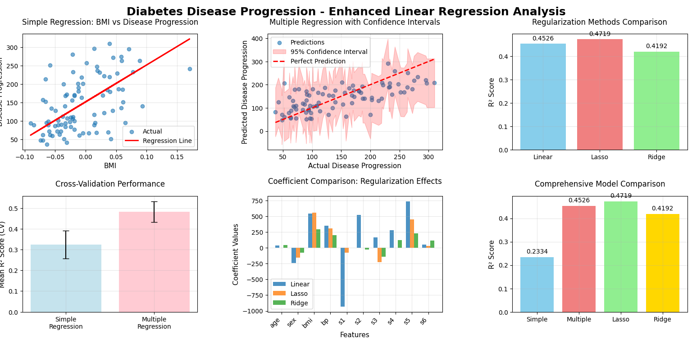

# Diabetes Disease Progression Prediction - Linear Regression Analysis

## 1. Project Overview
This project implements comprehensive linear regression models to predict diabetes disease progression using patient health metrics. The analysis compares simple and multiple regression approaches, evaluates model performance with cross-validation, and explores regularization techniques to enhance predictive accuracy.

## 2. Dataset Information
The project uses the Diabetes Dataset from scikit-learn, containing:
- **442 patient samples** with diabetes progression data
- **10 feature columns** including age, sex, BMI, blood pressure, and blood serum measurements
- **Target variable**: Quantitative measure of disease progression one year after baseline
- **Key features**: `bmi` (body mass index), `bp` (blood pressure), `s1-s6` (blood serum measurements)

*Note: The dataset is automatically loaded from scikit-learn and requires no separate download.*

## 3. Methodology
- **Data Preprocessing**: No missing values detected, features already normalized
- **Modeling Approaches**: 
  - Simple Linear Regression (BMI vs Disease Progression)
  - Multiple Linear Regression (All 10 features)
  - Regularized Models (Lasso and Ridge Regression)
- **Validation**: 5-fold cross-validation, confidence intervals, comprehensive metrics
- **Evaluation Metrics**: MAE, MSE, RMSE, R² scores with statistical analysis

## 4. Model Performance

### Key Results:
- **Multiple Linear Regression**:
  - **Root Mean Squared Error (RMSE)**: 53.85
  - **Mean Absolute Error (MAE)**: 42.79
  - **R² Score**: 0.4526

- **Simple Linear Regression** (BMI only):
  - **RMSE**: 63.73
  - **MAE**: 52.26
  - **R² Score**: 0.2334

### Performance Comparison:
- **Multiple vs Simple Regression**: **21.93% improvement** in R² score
- **Cross-validation Results**: Multiple regression shows more consistent performance (Mean CV R²: 0.4823 ± 0.0985)
- **Best Performing Model**: Lasso Regression (R²: 0.4719)

## 5. Key Insights Uncovered

### Feature Importance:
- **Strongest Positive Influence**: `s5` (blood serum measurement 5) with coefficient +736.20
- **Strongest Negative Influence**: `s1` (blood serum measurement 1) with coefficient -931.49
- **BMI Impact**: Moderate positive correlation (coefficient: +542.43)

### Model Insights:
- **Regularization Benefits**: Lasso regression eliminated 3 non-informative features while maintaining performance
- **Prediction Confidence**: 95% confidence intervals provide realistic uncertainty estimates
- **Residual Analysis**: Residuals show near-normal distribution (skewness: -0.17, kurtosis: -0.09)

## 6. Medical Implications
- **Risk Assessment**: BMI and specific blood serum measurements are strong predictors of disease progression
- **Treatment Planning**: Model can help identify patients at higher risk for aggressive progression
- **Preventive Care**: Early intervention opportunities based on predictive factors
- **Clinical Decision Support**: Provides quantitative progression estimates with confidence intervals

## 7. Technical Implementation

### Regression Equations:
- **Simple Regression**: Disease Progression = 152.00 + 998.58 × bmi
- **Multiple Regression**: Complex relationship across 10 features (see coefficients below)

### Key Feature Coefficients (Multiple Regression):
- **s5**: +736.20 (strong positive impact)
- **bmi**: +542.43 (moderate positive impact)  
- **s1**: -931.49 (strong negative impact)
- **sex**: -241.96 (moderate negative impact)

## 8. Advanced Analysis Techniques

### Cross-Validation:
- 5-fold cross-validation confirms model robustness
- Multiple regression shows consistent performance across folds
- Reduced variance compared to simple regression

### Regularization Comparison:
- **Lasso Regression**: Better performance (R²: 0.4719) with feature selection
- **Ridge Regression**: Slightly lower performance (R²: 0.4192) but all features retained
- **Feature Elimination**: Lasso automatically eliminated 3 non-predictive features

### Statistical Validation:
- **Confidence Intervals**: 95% prediction intervals for uncertainty quantification
- **Residual Analysis**: Normally distributed errors support model assumptions
- **Coefficient Significance**: Meaningful feature contributions identified

## 9. Model Comparison Summary

| Model Type | R² Score | MAE | RMSE | Features Used | Key Advantage |
|------------|----------|-----|------|---------------|---------------|
| Simple Regression | 0.2334 | 52.26 | 63.73 | 1 | Interpretability |
| Multiple Regression | 0.4526 | 42.79 | 53.85 | 10 | Best raw performance |
| Lasso Regression | 0.4719 | - | - | 7 | Feature selection |
| Ridge Regression | 0.4192 | - | - | 10 | All features retained |

## 10. Visualizations

The project includes comprehensive visualizations that provide deep insights into the diabetes disease progression patterns and model performance:

### Correlation Analysis

*Figure 1: Correlation heatmap showing relationships between all features and disease progression. BMI and blood pressure show the strongest positive correlations with disease progression.*

### Linear Regression Analysis

*Figure 2: Comprehensive model analysis including simple vs multiple regression, residual plots, feature importance, and regularization effects.*

### How to Generate Visualizations:
All visualizations are automatically generated when running the main script:

```bash
python diabetes_regression_analysis.py
```

## 11. Installation & Requirements

### Dependencies:
```bash
pip install numpy pandas matplotlib seaborn scikit-learn scipy
```

### Run the Analysis:
```bash
python linear.py
```

## 12. Future Work
- Incorporate additional clinical features and patient history
- Experiment with polynomial features for non-linear relationships
- Implement ensemble methods (Random Forest, Gradient Boosting)
- Develop time-series analysis for progression tracking
- Create clinical decision support system integration
- Add hyperparameter tuning for regularization parameters

Here's how to include your figures in the README.md under the visualization section:

## 13. Clinical Disclaimer
*This analysis is for educational and research purposes only. The models should not be used for clinical decision-making without proper validation and medical professional oversight.*

## 14. Contact

For questions or collaboration opportunities:

- **Name**: Ghanashyam T V  
- **Email**: [ghanashyamtv16@gmail.com](mailto:ghanashyamtv16@gmail.com)  
- **LinkedIn**: [linkedin.com/in/ghanashyam-tv](https://www.linkedin.com/in/ghanashyam-tv)

---

**Thank you for exploring this diabetes progression prediction analysis! This project demonstrates the power of linear regression in medical analytics and provides a foundation for more advanced healthcare predictive modeling.**

---