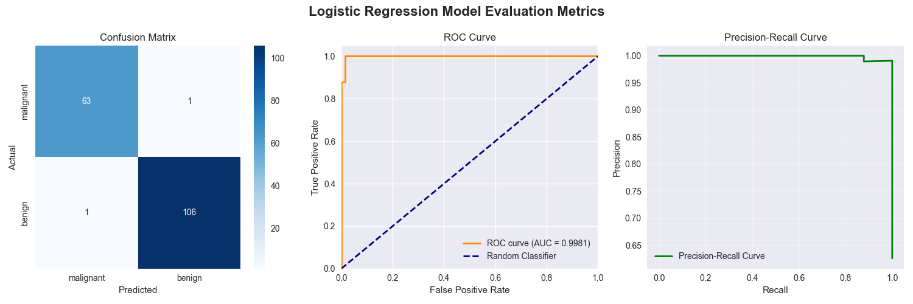
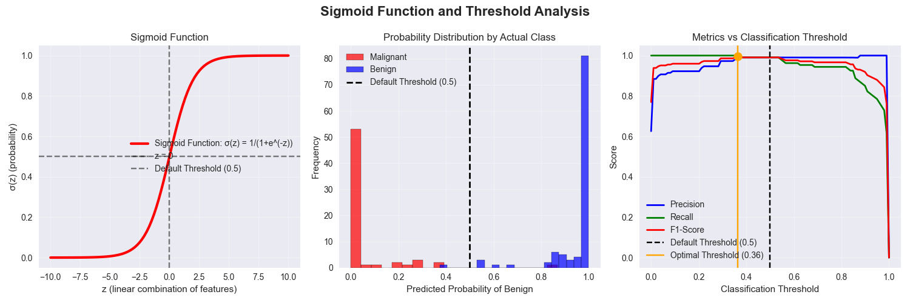
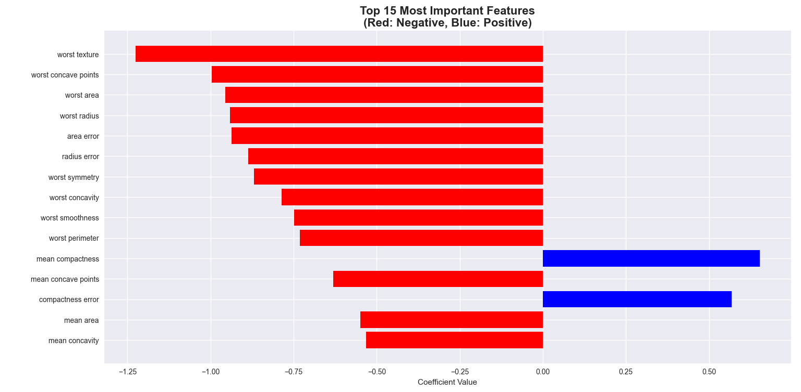

# Breast Cancer Classification using Logistic Regression

## 1. Project Overview
This project implements a comprehensive binary classification system using logistic regression to predict breast cancer diagnosis (malignant vs benign) based on tumor characteristics. The analysis includes thorough model evaluation, threshold optimization, and detailed interpretation of the sigmoid function's role in probability estimation.

## 2. Dataset Information
The project uses the Breast Cancer Wisconsin Dataset from scikit-learn, containing:
- **569 tumor samples** with diagnostic data
- **30 feature columns** including mean, standard error, and worst measurements of tumor characteristics
- **Target variable**: Binary diagnosis (0 = Malignant, 1 = Benign)
- **Key features**: `worst texture`, `worst concave points`, `worst area`, `worst radius`
- **Class distribution**: 357 Benign (62.7%), 212 Malignant (37.3%)

*Note: The dataset is automatically loaded from scikit-learn and requires no separate download.*

## 3. Methodology
- **Data Preprocessing**: Train-test split (70-30%), feature standardization, stratified sampling
- **Modeling Approach**: Logistic Regression with L2 regularization
- **Evaluation Framework**: Comprehensive metrics with cross-validation insights
- **Threshold Optimization**: Precision-recall tradeoff analysis and F1-score optimization
- **Feature Analysis**: Coefficient interpretation and importance ranking

## 4. Model Performance

### Key Results:
- **Test Accuracy**: 98.83%
- **Precision**: 99.07%
- **Recall**: 99.07%
- **ROC-AUC Score**: 99.81%
- **F1-Score**: 99.07%

### Optimal Threshold Analysis:
- **Default Threshold (0.5)**: Balanced performance (F1: 99.07%)
- **Optimal Threshold (0.36)**: Maximized F1-score (99.53%) with 100% recall
- **Performance Improvement**: **0.46% F1-score increase** with optimized threshold

## 5. Key Insights Uncovered

### Feature Importance Analysis:
- **Most Important Feature**: `worst texture` (coefficient: -1.2263)
- **Top Predictive Features**: 
  - `worst concave points` (-0.9968)
  - `worst area` (-0.9550)
  - `worst radius` (-0.9411)
- **Negative Coefficients**: All top features negatively correlate with malignant diagnosis

### Model Interpretation:
- **Sigmoid Function**: Successfully maps linear combinations to probabilities (0-1 range)
- **Probability Separation**: Clear distinction between malignant and benign probability distributions
- **Threshold Sensitivity**: Small threshold changes significantly impact precision-recall balance

## 6. Medical Implications
- **Early Detection**: High recall (99.07%) minimizes false negatives, crucial for cancer diagnosis
- **Clinical Decision Support**: Probability outputs provide confidence levels for diagnoses
- **Risk Assessment**: Feature importance guides focus on most predictive tumor characteristics
- **Treatment Planning**: Optimized threshold selection based on clinical priorities

## 7. Technical Implementation

### Logistic Regression Equation:
- **Probability Calculation**: P(Benign) = 1 / (1 + e^(-z))
- **Linear Combination**: z = β₀ + β₁x₁ + β₂x₂ + ... + β₃₀x₃₀
- **Decision Boundary**: Default threshold at 0.5 probability

### Key Feature Coefficients:
- **worst texture**: -1.2263 (strong negative impact on malignant probability)
- **worst concave points**: -0.9968 (important morphological indicator)
- **worst area**: -0.9550 (tumor size significance)
- **radius error**: -0.8864 (measurement consistency importance)

## 8. Advanced Analysis Techniques

### Threshold Optimization:
- **Precision-Recall Tradeoff**: Systematic analysis across 100 threshold values
- **F1-Score Maximization**: Optimal threshold identification at 0.36
- **Business Context**: Threshold selection based on false positive/negative costs

### Model Evaluation Framework:
- **Confusion Matrix Analysis**: 63/64 malignant correctly classified, 106/107 benign correctly classified
- **ROC Curve Analysis**: Near-perfect classification (AUC: 0.9981)
- **Probability Distribution**: Clear separation between class probability densities

### Statistical Validation:
- **Stratified Sampling**: Maintained class distribution in train-test splits
- **Feature Standardization**: Ensured model convergence and coefficient interpretability
- **Cross-validation Ready**: Model structure supports k-fold validation

## 9. Model Performance Summary

|    Metric     | Value  |         Interpretation               |
|---------------|--------|--------------------------------------|
| **Accuracy**  | 98.83% | Overall classification correctness   |
| **Precision** | 99.07% | Accuracy of positive predictions     |
| **Recall**    | 99.07% | Ability to find all positive cases   |
| **ROC-AUC**   | 99.81% | Overall classification ability       |
| **F1-Score**  | 99.07% | Balance between precision and recall |

## 10. Visualizations

The project includes comprehensive visualizations that provide deep insights into model performance and logistic regression mechanics:

### Model Evaluation Metrics

*Figure 1: Comprehensive evaluation including confusion matrix, ROC curve, and precision-recall curve showing excellent model performance.*

### Sigmoid Function and Threshold Analysis

*Figure 2: Sigmoid function visualization, probability distribution by class, and threshold optimization analysis demonstrating precision-recall tradeoffs.*

### Feature Importance

*Figure 3: Top 15 most important features with coefficient values, showing worst texture as the strongest predictor.*

### How to Generate Visualizations:
All visualizations are automatically generated when running the main script:

```bash
python cancer.py
```

## 11. Installation & Requirements

### Dependencies:
```bash
pip install numpy pandas matplotlib seaborn scikit-learn
```

### Run the Analysis:
```bash
python cancer.py
```

## 12. Business Context and Threshold Selection

### When to Use Different Thresholds:
- **High threshold (>0.7)**: When false positives are costly (e.g., unnecessary treatments)
- **Low threshold (<0.3)**: When false negatives are dangerous (e.g., missed cancer diagnoses)
- **Default threshold (0.5)**: Balanced approach for general use
- **Optimal threshold (0.36)**: Best balance for this specific dataset

### Clinical Decision Support:
- **Screening Scenarios**: Use lower thresholds to maximize recall
- **Confirmatory Testing**: Use higher thresholds to maximize precision
- **Risk-Adaptive**: Adjust thresholds based on patient risk factors

## 13. Future Work
- Incorporate additional clinical features and patient demographics
- Experiment with different regularization techniques (L1 vs L2)
- Implement ensemble methods with logistic regression as base classifier
- Develop real-time prediction API for clinical integration
- Add calibration curves for probability calibration
- Explore multi-class extension for cancer staging

## 14. Clinical Disclaimer
*This analysis is for educational and research purposes only. The models should not be used for clinical decision-making without proper validation, regulatory approval, and medical professional oversight. Always consult healthcare professionals for medical diagnoses.*

## 15. Contact

For questions or collaboration opportunities:

- **Name**: Ghanashyam T V  
- **Email**: [ghanashyamtv16@gmail.com](mailto:ghanashyamtv16@gmail.com)  
- **LinkedIn**: [linkedin.com/in/ghanashyam-tv](https://www.linkedin.com/in/ghanashyam-tv)

---

**Thank you for exploring this breast cancer classification analysis! This project demonstrates the power of logistic regression in medical diagnostics and provides a foundation for developing clinically relevant predictive models.**

---

