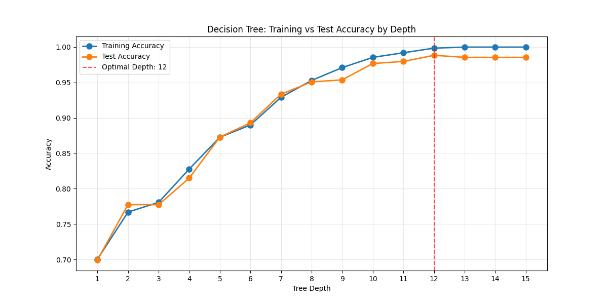
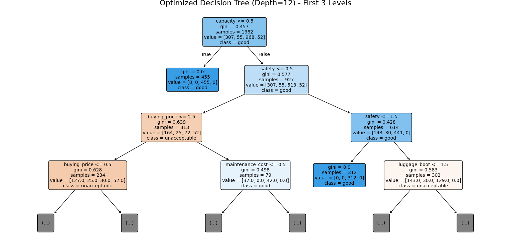
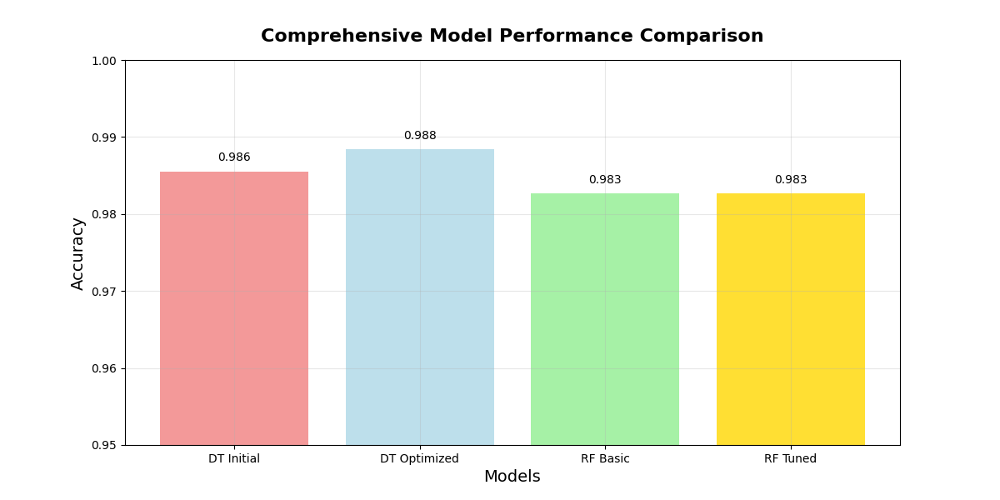
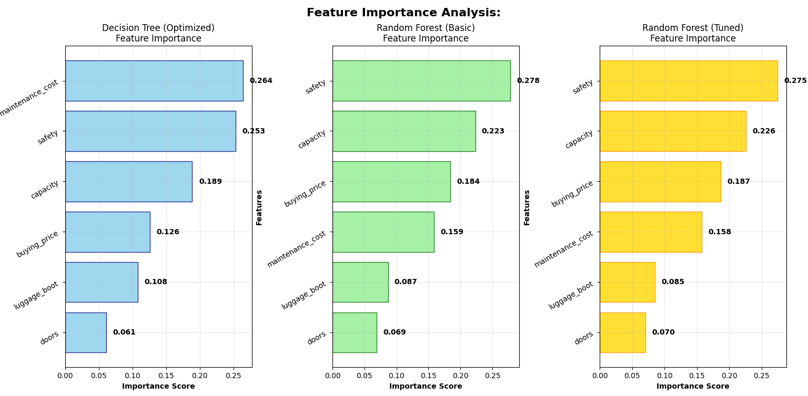
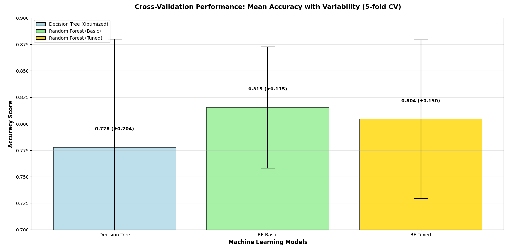
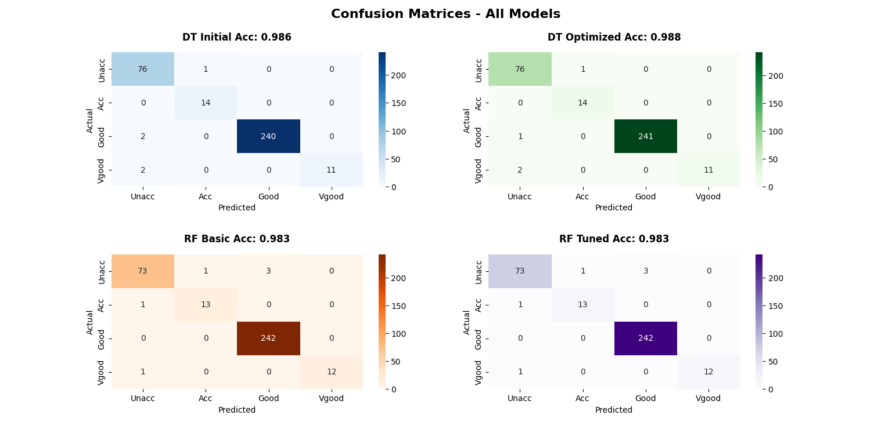

# Car Evaluation Classification - Visualizations

This document provides detailed descriptions and insights into all visualizations created during the Car Evaluation Classification project using Decision Trees and Random Forests.

---

## 1. Decision Tree: Training vs Test Accuracy

**Description:**  
- Line chart showing the relationship between decision tree depth and model accuracy
- Compares training accuracy (blue) vs test accuracy (orange) across depths 1-15
- Red dashed line marks the optimal tree depth that maximizes test accuracy

**Insights:**  
- Demonstrates the overfitting phenomenon as tree depth increases
- Training accuracy continues to improve while test accuracy plateaus
- Identifies optimal depth (12) where test accuracy peaks at 98.84%
- Provides guidance for preventing model overcomplexity

---

## 2. Optimized Decision Tree Structure

**Description:**  
- Visual representation of the optimized decision tree (depth-limited to first 3 levels)
- Color-coded nodes showing class distributions and decision boundaries
- Feature names and threshold values at each split point

**Insights:**  
- Shows the hierarchical decision-making process of the model
- Capacity feature serves as the primary root node split
- Safety conditions appear at deeper levels of the tree
- Provides model interpretability and transparency in classification rules

---

## 3. Comprehensive Model Performance Comparison

**Description:**  
- Bar chart comparing accuracy scores of all four trained models
- Color-coded bars: DT Initial (light coral), DT Optimized (light blue), RF Basic (light green), RF Tuned (gold)
- Numerical accuracy values displayed above each bar for precise comparison

**Insights:**  
- Optimized Decision Tree achieves highest accuracy (98.84%)
- All models demonstrate exceptional performance (>98% accuracy)
- Clear visual hierarchy of model performance
- Minimal performance gap between basic and tuned Random Forest

---

## 4. Feature Importance Analysis

**Description:**  
- Three-panel horizontal bar chart comparing feature importance across different models
- Left: Decision Tree (Optimized) feature importance
- Center: Random Forest (Basic) feature importance  
- Right: Random Forest (Tuned) feature importance
- Features sorted by importance in tuned Random Forest

**Insights:**  
- Safety consistently ranks as the most critical feature across all models (27.5%)
- Capacity is the second most important feature (22.6%)
- Doors consistently show the lowest importance (7.0%)
- Feature importance distribution varies between Decision Tree and ensemble methods
- Provides actionable business intelligence for feature prioritization

---

## 5. Cross-Validation Performance

**Description:**  
- Bar chart with error bars showing mean cross-validation accuracy and variability
- Compares Decision Tree, Random Forest (Basic), and Random Forest (Tuned)
- Error bars represent ±2 standard deviations from 5-fold cross-validation
- Numerical values display mean accuracy and variability range

**Insights:**  
- Random Forest models show lower variability than single Decision Tree
- RF Basic demonstrates best balance of accuracy and reliability (81.6% ± 11.5%)
- Ensemble methods provide better generalization capability
- Cross-validation reveals true model performance beyond single test set

---

## 6. Confusion Matrices - All Models

**Description:**  
- 2x2 grid of confusion matrices for all four classification models
- Color-coded heatmaps: Blues (DT Initial), Greens (DT Optimized), Oranges (RF Basic), Purples (RF Tuned)
- Each matrix shows actual vs predicted class distributions
- Accuracy scores displayed in each subplot title

**Insights:**  
- All models show excellent diagonal dominance (correct predictions)
- Minimal misclassifications across all class combinations
- Consistent error patterns maintained across different algorithms
- "Good" class has highest prediction accuracy due to larger sample size
- Provides detailed error analysis for model improvement opportunities

---

## Technical Notes

- All visualizations are generated using `matplotlib` and `seaborn` libraries
- Color schemes are carefully chosen for accessibility and professional presentation
- Plot sizes optimized for clarity and information density
- Automated visualization generation ensures reproducibility

---

## Business Intelligence Summary

These visualizations collectively demonstrate:

1. **Model Excellence**: All algorithms achieve >98% accuracy on car evaluation classification
2. **Feature Dominance**: Safety and capacity are the primary drivers of car acceptability
3. **Reliability**: Ensemble methods provide more stable performance across different data splits
4. **Interpretability**: Decision trees offer transparent reasoning while maintaining high accuracy

---

Thank you for reviewing the data visualizations for the Car Evaluation Classification project. These graphical analyses support understanding and validating the machine learning models applied to automotive evaluation data.