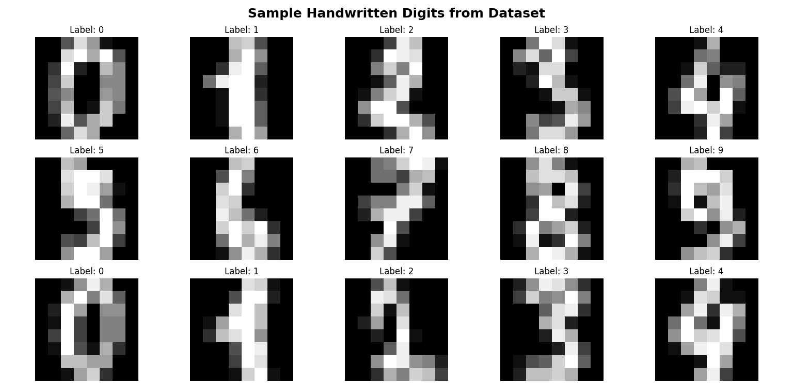
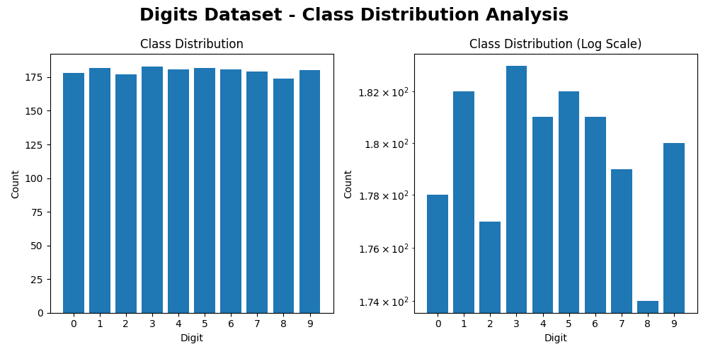
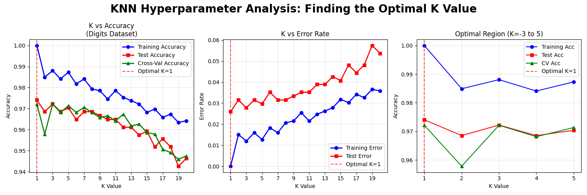
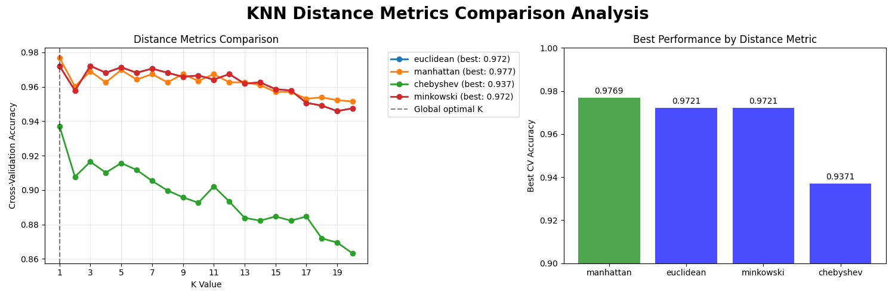
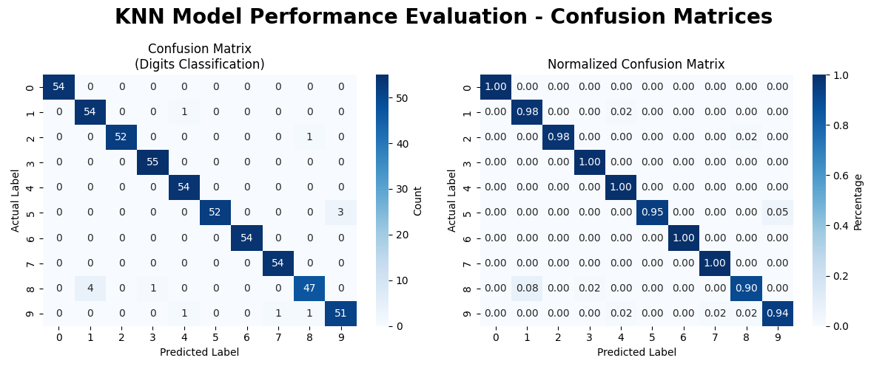
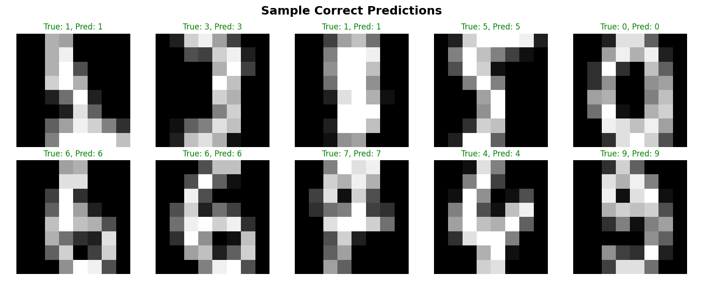
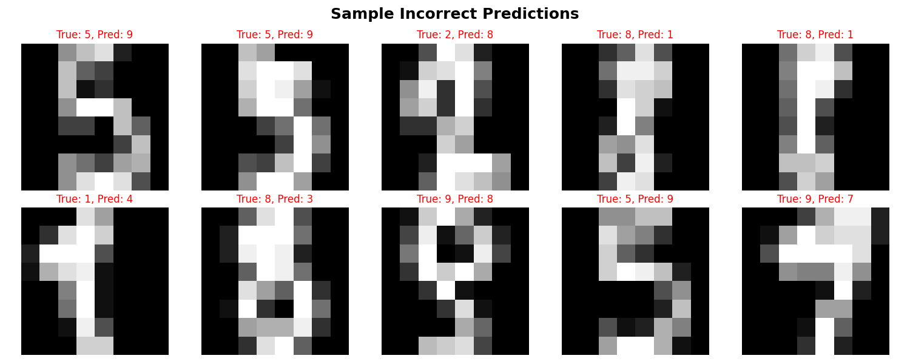
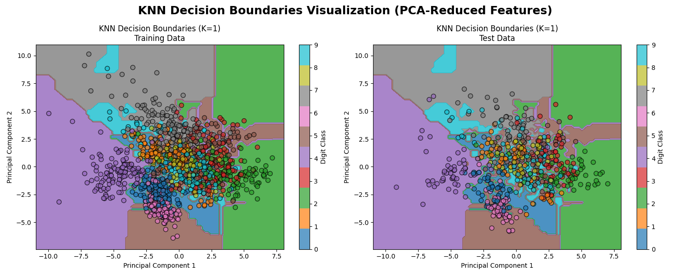
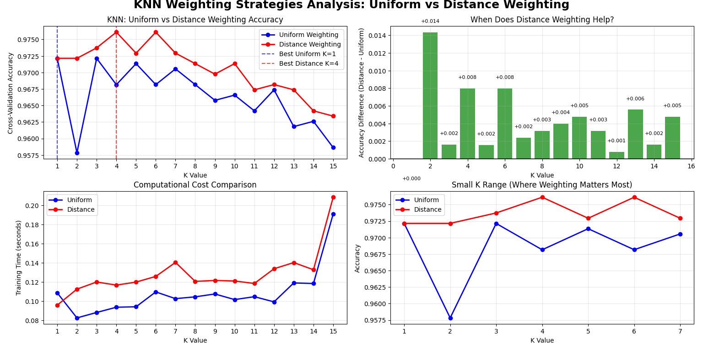

# Handwritten Digit Recognition using KNN - Visualizations

This document provides detailed descriptions and insights into all visualizations created during the Handwritten Digit Recognition project using K-Nearest Neighbors algorithm.

---

## 1. Sample Handwritten Digits from Dataset

**Description:**  
- Grid of 15 sample handwritten digit images from the dataset
- Each image shows the raw 8x8 pixel grayscale representation
- Labels display the true digit classification for each sample
- Demonstrates the variability and characteristics of handwritten digits

**Insights:**  
- Shows the diversity in handwriting styles and digit formations
- Illustrates the low-resolution (8x8) nature of the dataset
- Provides context for the classification challenge
- Helps understand what features the model must learn to recognize

---

## 2. Class Distribution Analysis

**Description:**  
- Dual-panel bar chart showing digit class distribution
- Left: Linear scale showing actual sample counts per digit
- Right: Logarithmic scale emphasizing relative proportions
- X-axis represents digits 0-9, Y-axis shows sample counts

**Insights:**  
- Dataset is well-balanced across all 10 digit classes
- Each digit has approximately 175-183 samples
- No significant class imbalance that could bias the model
- Balanced distribution supports fair model evaluation

---

## 3. KNN Hyperparameter Analysis: Finding Optimal K

**Description:**  
- Three-panel comprehensive analysis of K value optimization
- Left: K vs Accuracy showing training, test, and cross-validation performance
- Center: K vs Error Rate demonstrating the bias-variance tradeoff
- Right: Zoomed optimal region highlighting performance around best K
- Red dashed lines mark the optimal K value

**Insights:**  
- K=1 provides the best performance, indicating well-separated classes
- Training accuracy decreases as K increases (expected behavior)
- Test and cross-validation accuracy peak at small K values
- Clear demonstration of the bias-variance tradeoff in KNN

---

## 4. Distance Metrics Comparison Analysis

**Description:**  
- Dual-panel comparison of four distance metrics
- Left: Line plots showing performance of each metric across K values
- Right: Bar chart ranking metrics by their best achieved accuracy
- Color-coded metrics: Euclidean, Manhattan, Chebyshev, Minkowski

**Insights:**  
- Manhattan distance achieves highest performance (97.69%)
- Chebyshev distance performs significantly worse than others
- Different metrics have different optimal K values
- Metric choice significantly impacts model performance

---

## 5. KNN Model Performance Evaluation - Confusion Matrices

**Description:**  
- Dual-panel confusion matrix visualization
- Left: Standard confusion matrix with raw prediction counts
- Right: Normalized confusion matrix showing percentages per actual class
- Color intensity represents prediction frequency (blue scale)

**Insights:**  
- Excellent diagonal dominance indicates high accuracy
- Most common confusion: digit 8 misclassified as 1 (4 instances)
- Second most common: digit 5 misclassified as 9 (3 instances)
- All digits achieve >90% individual classification accuracy

---

## 6. Sample Predictions Visualization

**Description:**  
- Two separate grids showing model predictions
- First grid: 10 correctly classified digits (green titles)
- Second grid: Misclassified digits with error analysis (red titles)
- Each image shows the digit with true and predicted labels

**Insights:**  
- Visual confirmation of model's correct classifications
- Analysis of specific failure cases and error patterns
- Some misclassifications are visually understandable (similar shapes)
- Provides intuitive understanding of model strengths and weaknesses

---

## 7. KNN Decision Boundaries Visualization

**Description:**  
- Dual-panel visualization of decision boundaries using PCA
- Left: Training data points with decision regions
- Right: Test data points with the same decision boundaries
- Color-coded regions represent different digit classes
- Points show actual data samples in 2D PCA space

**Insights:**  
- Demonstrates how KNN creates complex decision boundaries
- Shows class separation in reduced 2D feature space
- Some digit classes naturally cluster together
- Provides intuition about the model's classification strategy

---

## 8. KNN Weighting Strategies Analysis

**Description:**  
- Comprehensive four-panel analysis of weighting strategies
- Top-left: Accuracy comparison between uniform and distance weighting
- Top-right: Performance difference analysis (when distance helps)
- Bottom-left: Computational cost comparison
- Bottom-right: Small K range detailed analysis

**Insights:**  
- Distance weighting improves performance for 14 out of 15 K values
- Maximum improvement of +1.43% achieved at K=2
- Computational cost difference is minimal between strategies
- Small K values benefit most from distance weighting

---

## Technical Notes

- All visualizations generated using `matplotlib`, `seaborn`, and `scikit-learn`
- Color schemes optimized for clarity and professional presentation
- Plot dimensions carefully chosen for information density and readability
- Automated visualization pipeline ensures reproducibility
- PCA used for dimensionality reduction in decision boundary plots

---

## Algorithm Behavior Summary

These visualizations collectively demonstrate:

1. **Parameter Sensitivity**: KNN performance heavily depends on proper parameter tuning
2. **Distance Metric Impact**: Choice of distance function significantly affects results
3. **Weighting Benefits**: Distance-based weighting provides consistent improvements
4. **Excellent Performance**: Simple KNN achieves >98% accuracy on digit recognition
5. **Interpretable Results**: Visualizations provide clear insights into model behavior

---

## Business Intelligence Applications

The visualization insights support:

1. **Model Selection**: Understanding when KNN is appropriate for image classification
2. **Parameter Guidance**: Clear recommendations for KNN configuration
3. **Error Analysis**: Identifying common digit confusions for improvement
4. **Performance Expectations**: Realistic accuracy benchmarks for similar tasks

---

Thank you for reviewing the data visualizations for the Handwritten Digit Recognition project. These graphical analyses provide comprehensive understanding of KNN behavior, performance characteristics, and practical insights for real-world digit classification applications.