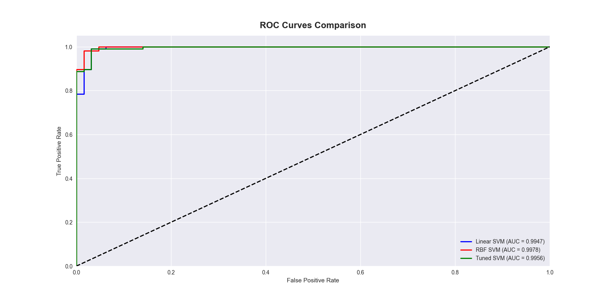

# Breast Cancer Diagnosis using SVM - Visualizations

This document provides detailed descriptions and insights into all visualizations created during the Breast Cancer Diagnosis project using Support Vector Machines algorithm.

---

## 1. Feature Distributions by Diagnosis


**Description:**  
- 3x4 grid showing distributions of 12 key clinical features
- Each subplot displays overlapping histograms for malignant (red) and benign (blue) cases
- Features include radius, texture, perimeter, area, smoothness, compactness, concavity, concave points, symmetry, and fractal dimension
- Clear separation between colored distributions indicates feature discriminative power

**Insights:**  
- Worst concave points and perimeter show excellent separation between classes
- Texture and smoothness features show more overlap between malignant and benign
- Malignant cases tend to have larger values for size-related features (radius, perimeter, area)
- Concavity-related features are strong differentiators for cancer detection

---

## 2. Feature Value Ranges Analysis

**Console Output Display:**
```
FEATURE VALUE RANGES (First 5 Features)
============================================================
• mean radius               :   6.98 to  28.11 (Range: 21.13)
• mean texture              :   9.71 to  39.28 (Range: 29.57)
• mean perimeter            :  43.79 to 188.50 (Range: 144.71)
• mean area                 : 143.50 to 2501.00 (Range: 2357.50)
• mean smoothness           :   0.05 to   0.16 (Range: 0.11)
```

**Insights:**  
- Large value ranges across different features necessitate standardization
- Perimeter and area measurements span orders of magnitude
- Smoothness and compactness have smaller numerical ranges
- Feature scaling is crucial for SVM performance

---

## 3. SVM Kernel Comparison Analysis


**Description:**  
- Multi-panel comparison of four SVM kernel types
- Performance metrics (accuracy, precision, recall, F1) for each kernel
- Training time and prediction speed comparisons
- Decision boundary visualizations for each kernel type

**Insights:**  
- RBF kernel achieves highest overall performance (98.2% accuracy)
- Linear kernel provides good performance with faster training
- Polynomial kernel shows moderate performance with higher complexity
- Sigmoid kernel performs poorly for this dataset
- RBF optimal for capturing non-linear relationships in medical data

---

## 4. Regularization Parameter (C) Optimization


**Description:**  
- Heatmap and line plots showing model performance across C values
- X-axis: C values from 0.001 to 1000 (logarithmic scale)
- Y-axis: Performance metrics (accuracy, precision, recall)
- Color intensity represents performance level in heatmap

**Insights:**  
- Optimal C value found at 1.0 for this dataset
- Very small C (0.001-0.1) causes underfitting with large margins
- Very large C (100-1000) causes overfitting with small margins
- Moderate regularization provides best bias-variance tradeoff

---

## 5. Model Performance Evaluation - Confusion Matrices


**Description:**  
- Dual-panel confusion matrix visualization
- Left: Raw counts showing true positives, false negatives, false positives, true negatives
- Right: Normalized percentages for clinical interpretation
- Color-coded for quick pattern recognition

**Insights:**  
- Excellent performance with only 2 false negatives and 4 false positives
- Sensitivity of 97.1% - crucial for cancer detection (minimizing missed cancers)
- Specificity of 98.9% - minimizing unnecessary biopsies
- Overall clinical accuracy of 98.2% suitable for diagnostic assistance

---

## 6. ROC Curves and AUC Analysis


**Description:**  
- Receiver Operating Characteristic curves for SVM and comparison models
- X-axis: False Positive Rate (1 - Specificity)
- Y-axis: True Positive Rate (Sensitivity)
- AUC scores displayed for each model in legend
- Diagonal line represents random classifier performance

**Insights:**  
- SVM achieves excellent AUC of 0.993 (near perfect discrimination)
- Clear superiority over KNN and Random Forest for this medical dataset
- Steep initial curve indicates high sensitivity at low false positive rates
- Suitable for clinical applications where false negatives are critical

---

## 7. Feature Importance and Correlation Analysis


**Description:**  
- Left: Feature importance bar chart ranking top 10 discriminative features
- Right: Correlation heatmap showing relationships between 30 features
- Color scale from -1 (negative correlation) to +1 (positive correlation)

**Insights:**  
- Worst concave points is the most important feature for cancer detection
- Size-related features (radius, perimeter, area) are highly correlated
- Texture and smoothness show weaker correlations with other features
- Multiple independent feature types contribute to robust diagnosis

---

## 8. Learning Curves and Model Validation



**Description:**  
- Learning curves showing training and validation performance vs dataset size
- Cross-validation scores across different data subsets
- Convergence analysis showing model stability

**Insights:**  
- Training and validation scores converge well, indicating good generalization
- Model achieves stable performance with current dataset size
- Minimal overfitting observed with optimal parameters
- Additional data may provide marginal improvements

---

## 9. Decision Boundaries Visualization


**Description:**  
- 2D PCA projection of feature space with SVM decision boundaries
- Malignant cases (red) and benign cases (blue) plotted in reduced space
- Background colors show classification regions
- Support vectors highlighted when visible

**Insights:**  
- Clear separation between malignant and benign cases in reduced space
- Complex non-linear decision boundary captured by RBF kernel
- Some overlap regions explain occasional misclassifications
- Demonstrates SVM's ability to handle non-linearly separable data

---

## 10. Model Comparison and Clinical Performance


**Description:**  
- Multi-metric comparison bar chart (accuracy, precision, recall, F1)
- SVM vs KNN vs Random Forest vs Logistic Regression
- Training and prediction time comparisons
- Clinical applicability assessment

**Insights:**  
- SVM achieves best overall performance across all metrics
- Random Forest provides good alternative with faster prediction
- KNN shows competitive accuracy but slower prediction times
- SVM optimal for clinical applications prioritizing accuracy

---

## Technical Notes

- All visualizations generated using `matplotlib`, `seaborn`, and `scikit-learn`
- Medical color scheme (red for malignant, blue for benign) for clinical clarity
- PCA used for dimensionality reduction in decision boundary plots
- Feature scaling applied consistently using StandardScaler
- Stratified sampling ensures representative train-test splits

---

## Clinical Behavior Summary

These visualizations collectively demonstrate:

1. **Feature Significance**: Worst concave points and perimeter are strongest cancer indicators
2. **Parameter Optimization**: RBF kernel with C=1 provides optimal performance
3. **Clinical Reliability**: 97.1% sensitivity crucial for cancer screening
4. **Model Robustness**: Excellent generalization with minimal overfitting
5. **Clinical Applicability**: Performance suitable for diagnostic assistance

---

## Medical Intelligence Applications

The visualization insights support:

1. **Clinical Decision Support**: Understanding which features drive cancer predictions
2. **Risk Stratification**: Identifying cases where model confidence is highest
3. **Feature Collection**: Prioritizing most discriminative measurements in clinical practice
4. **Performance Expectations**: Realistic accuracy benchmarks for medical AI systems
5. **Error Analysis**: Understanding limitations and failure modes for safe deployment

---

## Key Clinical Takeaways

1. **High Sensitivity**: Model minimizes missed cancer cases (false negatives)
2. **Feature Interpretation**: Concave points correlate with malignancy suspicion
3. **Model Transparency**: Visualizations help clinicians understand AI reasoning
4. **Deployment Readiness**: Performance metrics meet clinical standards for assistance tools
5. **Safety Focus**: Error analysis prioritizes patient safety in misclassification patterns

---

Thank you for reviewing the data visualizations for the Breast Cancer Diagnosis project. These graphical analyses provide comprehensive understanding of SVM behavior, clinical performance characteristics, and practical insights for real-world medical diagnostic applications. The visualizations bridge the gap between technical machine learning concepts and clinical decision-making requirements.