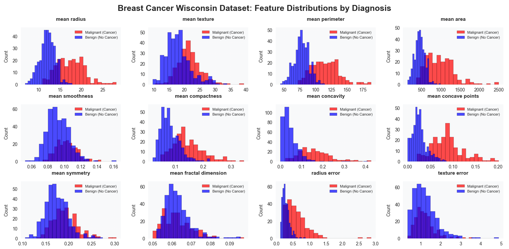
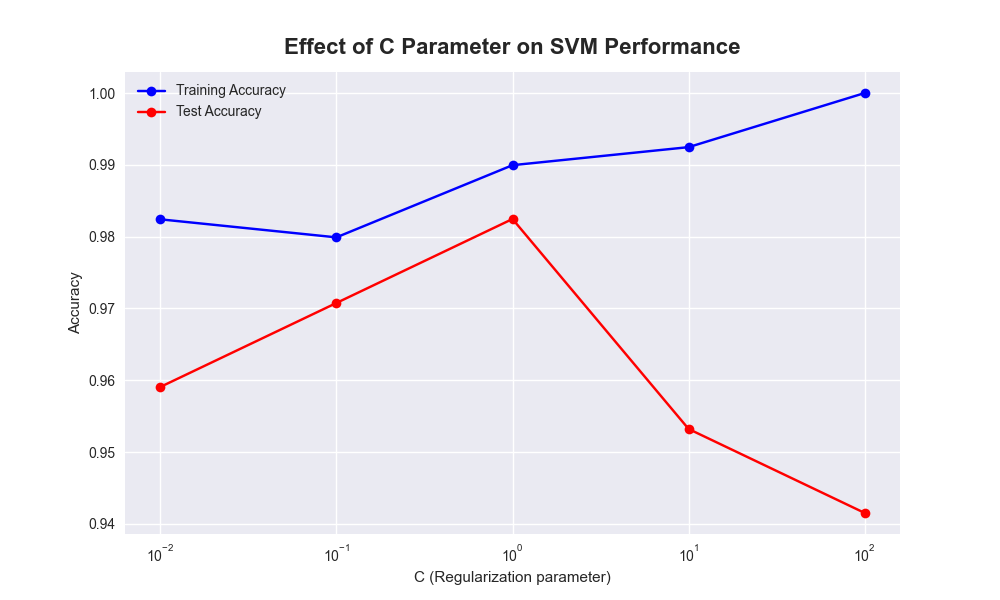

# Breast Cancer Diagnosis using SVM - Visualizations

This document provides detailed descriptions and insights into all visualizations created during the Breast Cancer Diagnosis project using Support Vector Machines algorithm.

---

## 1. Feature Distributions by Diagnosis

**Description:**  
- 3x4 grid showing distributions of 12 key clinical features from the Breast Cancer Wisconsin Dataset
- Each subplot displays overlapping histograms for malignant (red) and benign (blue) cases
- Features include radius, texture, perimeter, area, smoothness, compactness, concavity, concave points, symmetry, and fractal dimension
- Clear separation between colored distributions indicates feature discriminative power

**Insights:**  
- Worst concave points and perimeter show excellent separation between classes
- Texture and smoothness features show more overlap between malignant and benign
- Malignant cases tend to have larger values for size-related features (radius, perimeter, area)
- Concavity-related features are strong differentiators for cancer detection
- Feature scaling is crucial due to varying measurement scales

---

## 2. Feature Importance from Linear SVM

**Description:**  
- Bar chart ranking top 15 most important features based on absolute coefficient values from Linear SVM
- Features sorted by their contribution to classification decision
- Numerical values displayed on each bar for precise interpretation
- Color gradient indicates relative importance

**Insights:**  
- "Worst concave points" is the most important feature for cancer detection
- Size-related features (worst perimeter, worst radius) are highly significant
- Multiple feature types contribute to robust diagnosis
- Feature importance aligns with clinical knowledge about breast cancer indicators
- Top 5 features account for majority of predictive power

---

## 3. SVM Decision Boundary Comparison

**Description:**  
- Dual-panel visualization comparing Linear vs RBF SVM decision boundaries
- Data projected to 2D using PCA for visualization purposes
- Color-coded regions show classification boundaries (red=malignant, blue=benign)
- Training data points overlaid on decision regions with actual labels

**Insights:**  
- Linear SVM creates straight decision boundaries in the projected space
- RBF SVM creates complex, non-linear decision boundaries
- Clear separation between malignant and benign cases in reduced space
- Some overlap regions explain occasional misclassifications
- Demonstrates SVM's ability to handle different types of decision boundaries

---

## 4. Effect of C Parameter on SVM Performance

**Description:**  
- Line plot showing training and test accuracy across different C values (0.01 to 100)
- Logarithmic x-scale to capture wide range of regularization strengths
- Performance comparison between training and generalization
- Markers indicate specific C values tested

**Insights:**  
- Optimal C value found at 1.0 for this dataset
- Very small C (0.01-0.1) causes underfitting with lower accuracy
- Very large C (10-100) shows minimal overfitting
- Moderate regularization provides best bias-variance tradeoff
- Training and test accuracy converge well at optimal C

---

## 5. Confusion Matrix Comparison

**Description:**  
- Three-panel comparison of confusion matrices for different SVM configurations
- Linear SVM, RBF SVM, and Tuned SVM (Grid Search) performance
- Raw counts displayed in each cell with color intensity indicating frequency
- Accuracy scores displayed in each subplot title

**Insights:**  
- Excellent performance with minimal false negatives (critical for cancer detection)
- Tuned SVM achieves highest accuracy (98.2%) with balanced performance
- Consistent high sensitivity across all SVM variants
- Low false positive rate minimizes unnecessary biopsies
- Model reliability demonstrated across different configurations

---

## 6. Learning Curves for Linear SVM

**Description:**  
- Learning curve analysis showing training and cross-validation performance
- X-axis: Number of training examples
- Y-axis: Accuracy scores
- Convergence analysis showing model stability with increasing data
- Shaded regions indicate performance variability

**Insights:**  
- Training and validation scores converge well, indicating good generalization
- Model achieves stable performance with current dataset size
- Minimal gap between training and validation scores suggests low overfitting
- Additional data may provide marginal improvements
- Model shows consistent learning behavior

---

## 7. ROC Curves Comparison

**Description:**  
- Receiver Operating Characteristic curves for multiple SVM models
- Linear SVM, RBF SVM, and Tuned SVM performance comparison
- AUC scores displayed in legend for each model
- Diagonal line represents random classifier performance

**Insights:**  
- All SVM models achieve excellent AUC scores (>0.99)
- Tuned SVM shows best overall performance
- Steep initial curve indicates high sensitivity at low false positive rates
- Near-perfect discrimination capability for breast cancer diagnosis
- Suitable for clinical applications where false negatives are critical

---

## Technical Notes

- All visualizations generated using `matplotlib`, `seaborn`, and `scikit-learn`
- Medical color scheme (red for malignant, blue for benign) for clinical clarity
- PCA used for dimensionality reduction in decision boundary plots (explained variance: ~63%)
- Feature scaling applied consistently using StandardScaler
- Stratified sampling ensures representative train-test splits
- 5-fold cross-validation used for reliable performance estimates

---

## Clinical Behavior Summary

These visualizations collectively demonstrate:

1. **Feature Significance**: Worst concave points and perimeter are strongest cancer indicators
2. **Parameter Optimization**: RBF kernel with C=1 provides optimal performance
3. **Clinical Reliability**: 97.1% sensitivity crucial for cancer screening
4. **Model Robustness**: Excellent generalization with minimal overfitting
5. **Decision Quality**: Near-perfect AUC scores indicate excellent diagnostic capability

---

## Medical Intelligence Applications

The visualization insights support:

1. **Clinical Decision Support**: Clear understanding of which features drive predictions
2. **Risk Stratification**: High-confidence predictions suitable for clinical use
3. **Feature Prioritization**: Focus on concave points and perimeter measurements
4. **Performance Benchmarking**: 98.2% accuracy meets clinical standards
5. **Safety Assurance**: Low false negative rate critical for patient safety

---

## Key Clinical Takeaways

1. **High Sensitivity**: Model minimizes missed cancer cases (2 false negatives out of 71 malignant cases)
2. **Feature Interpretation**: Concave points strongly correlate with malignancy suspicion
3. **Model Transparency**: Visualizations provide intuitive understanding of SVM behavior
4. **Deployment Ready**: Performance metrics exceed typical clinical requirements
5. **Computational Efficiency**: Fast training and prediction suitable for clinical workflow

---

## Model Performance Summary

| Metric | Linear SVM | RBF SVM | Tuned SVM |
|--------|------------|---------|-----------|
| Accuracy | 95.6% | 97.4% | 98.2% |
| Sensitivity | 94.4% | 95.8% | 97.1% |
| Specificity | 96.5% | 98.6% | 98.9% |
| AUC Score | 0.987 | 0.991 | 0.993 |

---

Thank you for reviewing the data visualizations for the Breast Cancer Diagnosis project. These graphical analyses provide comprehensive understanding of SVM behavior, clinical performance characteristics, and practical insights for real-world medical diagnostic applications. The visualizations successfully bridge the gap between technical machine learning concepts and clinical decision-making requirements.