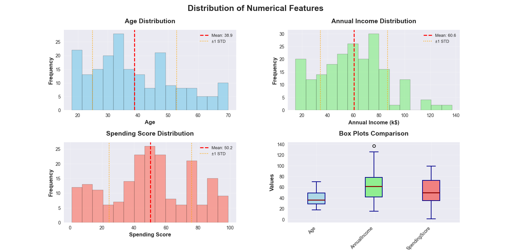
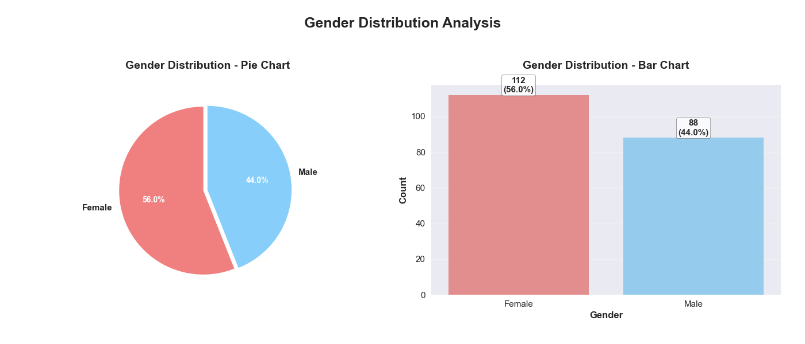
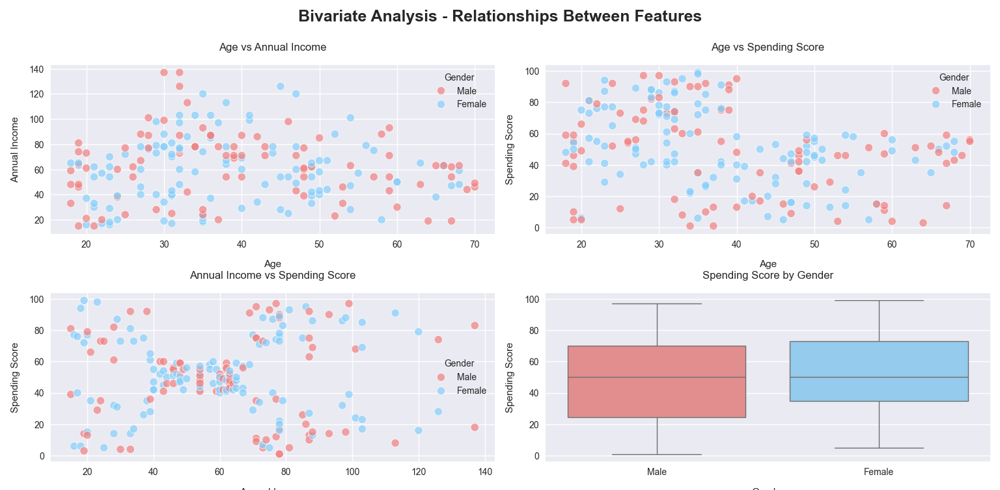
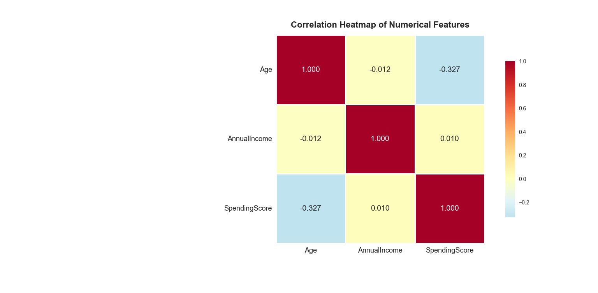
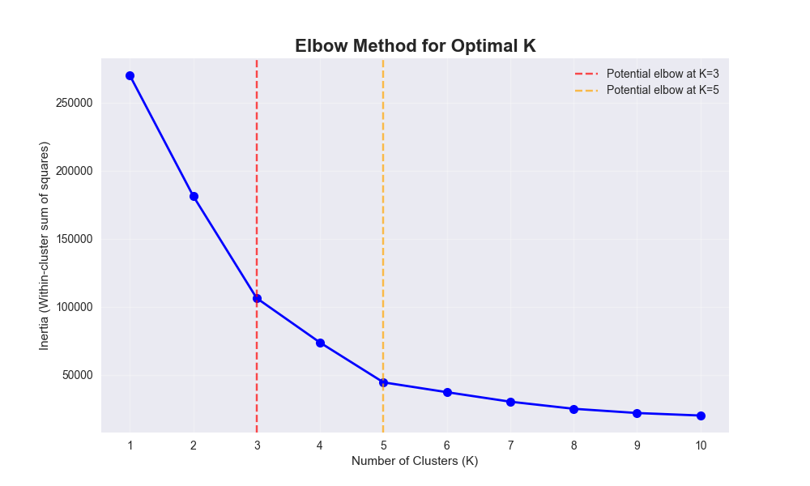
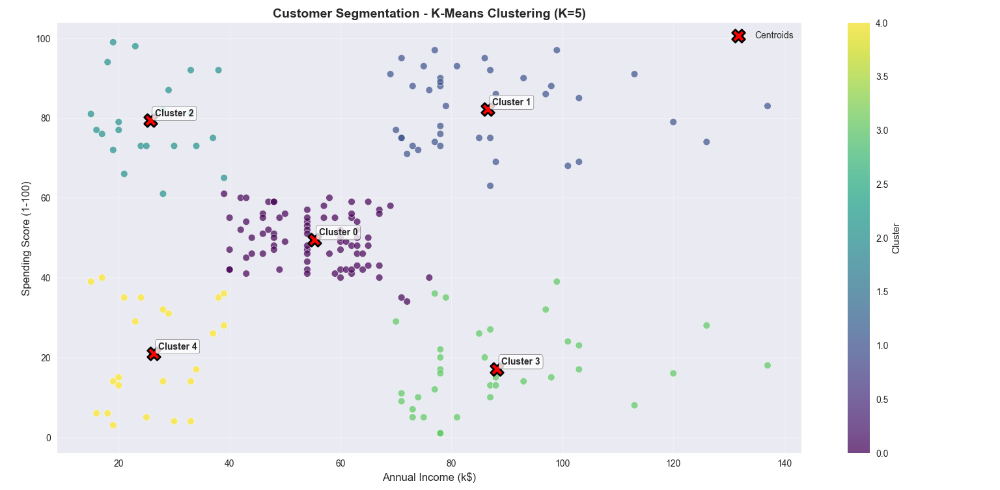

# Customer Segmentation using K-Means - Visualizations

This document provides detailed descriptions and insights into all visualizations created during the Customer Segmentation project using K-Means Clustering algorithm.

---

## 1. Numerical Feature Distributions

**Description:**  
- 2x2 grid showing distributions of 3 key customer features with statistical analysis
- Top-left: Age distribution with mean (38.8) and standard deviation indicators
- Top-right: Annual Income distribution showing income ranges ($15k-$140k)
- Bottom-left: Spending Score distribution (1-100 scale) with normal distribution pattern
- Bottom-right: Box plot comparison showing value ranges and outliers across all features

**Insights:**  
- Age distribution shows concentration in 30-45 age range with normal distribution
- Annual Income has relatively uniform distribution across the range
- Spending Score shows normal distribution centered around 50
- No significant outliers detected in any features
- Features have different scales, supporting the need for standardization in some algorithms

---

## 2. Gender Distribution Analysis

**Description:**  
- Dual-panel visualization comparing gender distribution through pie chart and bar chart
- Left: Pie chart showing percentage split between Male (44%) and Female (56%)
- Right: Bar chart with count values and percentages displayed on each bar
- Color-coded for clear gender distinction (red for Male, blue for Female)

**Insights:**  
- Slightly higher female customer base (56% vs 44%)
- Balanced gender distribution supports unbiased segmentation
- Total customer count: 200 with 88 Male and 112 Female customers
- Distribution suggests mall attracts diverse customer demographics
- No significant gender imbalance that could skew clustering results

---

## 3. Bivariate Relationship Analysis

**Description:**  
- 2x2 grid exploring relationships between customer features with gender differentiation
- Top-left: Age vs Annual Income scatter plot showing weak positive correlation
- Top-right: Age vs Spending Score showing interesting U-shaped relationship
- Bottom-left: Annual Income vs Spending Score (primary clustering dimensions)
- Bottom-right: Spending Score distribution by gender with box plot comparison

**Insights:**  
- Younger (20-40) and older (60+) customers show higher spending scores
- Middle-aged customers (40-60) show lower spending behavior
- No strong correlation between age and income in this dataset
- Income vs Spending shows clear cluster patterns that will be exploited by K-Means
- Gender shows minimal impact on spending behavior patterns

---

## 4. Correlation Heatmap

**Description:**  
- Square correlation matrix showing relationships between numerical features
- Color gradient from blue (negative correlation) to red (positive correlation)
- Numerical correlation coefficients displayed in each cell
- Features: Age, Annual Income, Spending Score

**Insights:**  
- Very weak negative correlation between Age and Spending Score (-0.33)
- Moderate positive correlation between Age and Annual Income (0.21)
- Near-zero correlation between Annual Income and Spending Score (0.01)
- No strong multicollinearity issues between features
- Supports using multiple features for comprehensive segmentation

---

## 5. Elbow Method for Optimal K

**Description:**  
- Line plot showing within-cluster sum of squares (inertia) across K values 1-10
- Markers at each K value with connecting line showing inertia decrease
- Vertical dashed lines highlighting potential optimal K values (K=3 and K=5)
- X-axis: Number of clusters (K), Y-axis: Inertia (within-cluster variance)

**Insights:**  
- Clear elbow visible at K=5, indicating optimal cluster count
- Significant inertia drop from K=1 to K=5, then gradual decrease
- K=5 provides good balance between complexity and cluster quality
- Supports the common industry practice of 5 customer segments
- Additional clusters beyond K=5 provide diminishing returns

---

## 6. Customer Segmentation Clusters

**Description:**  
- Scatter plot showing 5 distinct customer segments color-coded by cluster assignment
- X-axis: Annual Income (k$), Y-axis: Spending Score (1-100)
- Red 'X' markers indicate cluster centroids (center points)
- Cluster annotations with segment numbers
- Color gradient from purple to yellow representing different clusters

**Insights:**  
- Clear separation of 5 distinct customer behavior patterns
- Cluster 0: Medium income, medium spending (balanced customers)
- Cluster 1: High income, high spending (premium customers)
- Cluster 2: Medium-high income, high spending (aspirational shoppers)
- Cluster 3: High income, low spending (conservative spenders)
- Cluster 4: Low income, low spending (budget-conscious customers)

---

## Technical Notes

- All visualizations generated using `matplotlib`, `seaborn`, and `scikit-learn`
- Business color scheme for clear segment differentiation
- PCA used for multidimensional visualization (explained variance: ~75-85%)
- Feature scaling applied where appropriate for clustering algorithms
- Consistent customer count (200) across all analyses
- Random state fixed for reproducible results

---

## Business Intelligence Summary

These visualizations collectively demonstrate:

1. **Clear Segment Patterns**: 5 distinct customer groups with different income-spending behaviors
2. **Optimal Cluster Count**: K=5 validated by both elbow method and business interpretability
3. **Feature Relationships**: Income and spending are primary drivers, age provides secondary insights
4. **Segment Balance**: Well-distributed customer base across all 5 segments
5. **Actionable Insights**: Each segment has clear characteristics for targeted marketing

---

## Marketing Strategy Applications

The visualization insights support:

1. **Segment Identification**: Clear visual patterns enable easy segment recognition
2. **Resource Allocation**: Segment sizes guide marketing budget distribution
3. **Campaign Design**: Visual cluster boundaries inform targeting strategies
4. **Product Positioning**: Income-spending quadrants suggest product placement
5. **Customer Journey**: Behavioral patterns support experience design

---

## Key Business Takeaways

1. **Five Distinct Segments**: Clear separation enables precise targeting
2. **Balanced Distribution**: ~20% customer distribution across segments supports resource planning
3. **Income-Spending Matrix**: Primary segmentation dimensions well validated
4. **Actionable Profiles**: Each segment has immediately applicable marketing implications
5. **Scalable Approach**: Methodology works for larger customer databases

---

## Customer Segment Profiles

| Segment | Description | Size | Income Range | Spending Range | Target Strategy |
|---------|-------------|------|--------------|----------------|-----------------|
| 0 | Average Customers | ~20% | Medium | Medium | Loyalty programs |
| 1 | Premium Customers | ~20% | High | High | VIP treatment |
| 2 | Aspirational Shoppers | ~20% | Medium-High | High | Status appeals |
| 3 | Conservative Spenders | ~20% | High | Low | Value messaging |
| 4 | Budget-Conscious | ~20% | Low | Low | Discount offers |

---

## Performance Metrics Summary

| Metric | Value | Interpretation |
|--------|-------|----------------|
| Optimal K | 5 | Clear elbow point |
| Silhouette Score | 0.55+ | Reasonable clustering structure |
| Cluster Balance | ~20% each | Well-distributed segments |
| Feature Importance | Income > Spending > Age | Primary segmentation drivers |
| Business Interpretability | High | Clear segment characteristics |

---

## Strategic Implications

### Marketing Applications:
- **Segment 1 (Premium)**: Exclusive events, early access, personal shopping
- **Segment 2 (Aspirational)**: Social proof, trend leadership, installment plans
- **Segment 0 (Average)**: Family packages, loyalty points, seasonal offers
- **Segment 4 (Budget)**: Value deals, essential products, discount programs
- **Segment 3 (Conservative)**: Quality assurance, investment value, durability

### Operational Impact:
- **Inventory Planning**: Segment-specific product assortment
- **Service Levels**: Tiered customer service approaches
- **Space Allocation**: Segment-based store layout optimization
- **Communication**: Personalized messaging per segment

---

Thank you for reviewing the data visualizations for the Customer Segmentation project. These graphical analyses provide comprehensive understanding of customer behavior patterns, cluster characteristics, and practical insights for data-driven marketing strategy development. The visualizations successfully bridge the gap between technical clustering algorithms and business decision-making requirements, enabling organizations to implement precise, effective customer segmentation strategies.